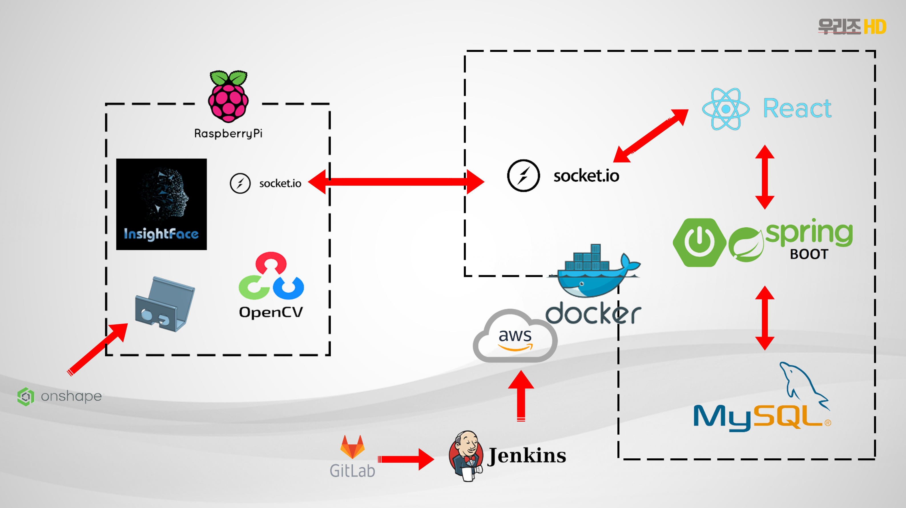
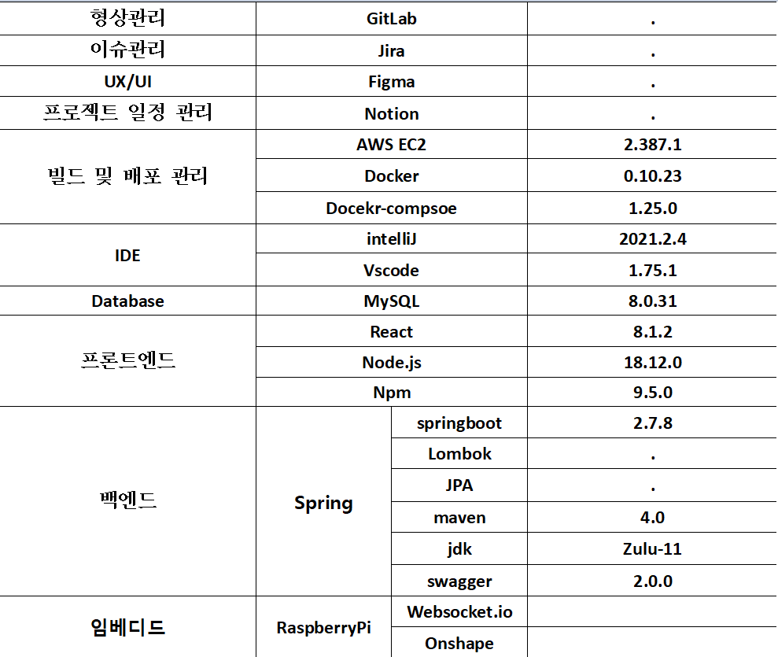
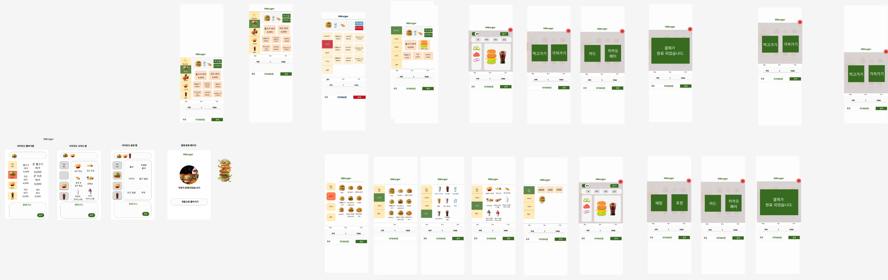
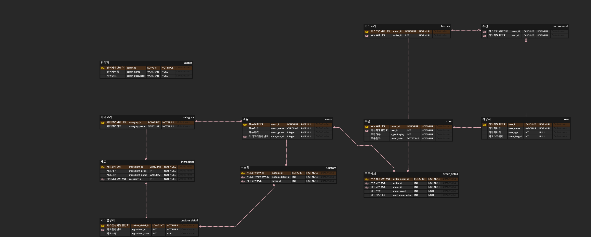

# KIOSK

> [1. 프로젝트 개요](##1. 프로젝트 개요)
>
> [2. 서비스 및 기능 소개](##2. 서비스 및 기능 소개)
>
> ​	[2.1. 사용자의 얼굴 인식하여 나이 판별](###2.1. 사용자의 얼굴 인식하여 나이 판별)
> ​	[2.2. 사용자의 키 측정하여 화면 및 UI 높이 조정](###2.2. 사용자의 키 측정하여 화면 및 UI 높이 조정)
> ​	[2.3. 햄버거 커스텀 기능](###2.3. 햄버거 커스텀 기능)
>
> [3. 서비스 화면](##3. 서비스 화면)
>
> ​	[3.1. 일반 모드 메인화면](###3.1. 일반 모드 메인화면)
> ​	[3.2. 이지 모드 메인화면](###3.2. 이지 모드 메인화면)
> ​	[3.3. 일반 모드 커스텀 화면](###3.3. 일반 모드 커스텀 화면)
> ​	[3.4. 장바구니 화면](###3.4. 장바구니 화면)
> ​	[3.5. 포장 여부 화면](###3.5. 포장 여부 화면)
> ​	[3.6. 결제 화면](###3.6. 결제 화면)
>
> [4. 시스템 아키텍쳐](###4. 시스템 아키텍쳐)
>
> [5. 개발 환경](###5. 개발 환경)
>
> [6. Figma](###6. Figma)
>
> [7. ERD](###7. ERD)
>
> [8. 서비스 및 기술 특장점](###8. 서비스 및 기술 특장점)

## 1. 프로젝트 개요

:four_leaf_clover: 프로젝트명 : Kisok

:four_leaf_clover: 한줄 소개 : 사용자의 얼굴을 인식해 나이, 키를 분석하여 맞춤 UI 및 서비스를 제공하는 햄버거 키오스크

:four_leaf_clover: 개발 기간 : 23.01.03 ~ 23.02.17 (6주)

:four_leaf_clover: 팀원  : 김영준, 김유진, 김도윤, 선민영, 정찬영, 조은비

:four_leaf_clover: 사용 기술 스택 : SpringBoot, React, RaspberryPi, Docker, AWS, OpenCV

## 2. 서비스 및 기능 소개

###  2.1. 사용자의 얼굴 인식하여 나이 판별

키오스크 전면 카메라로 사용자의 얼굴을 인식합니다. 화면을 사진을 찍어 이를 통해 분석을 진행합니다. OpenCV를 통해 분석을 진행하는데 이를 통해 사용자의 나이를 오차 범위 5살 정도로 확인할 수 있었습니다. 특정 나이가 넘는다면 UI를 이지모드로 전환하여 편의성을 제공합니다. 만약 이지 모드로 화면이 전환되었는데 사용하고 싶지 않다면 일반 모드로 돌아갈 수 있습니다.

### 2.2. 사용자의 키 측정하여 화면 및 UI 높이 조정

키오스크 전면 카메라와 하단에 부착된 초음파 센서를 통해 사용자의 키를 대략적으로 측정합니다. 키를 3단계로 구분을 하였고, 물리적으로 움직이는 방법이 아닌 SW 적으로 전체적인 UI를 상단, 중간, 하단으로 배치되도록 했습니다.

### 2.3. 햄버거 커스텀 기능

샌드위치를 커스텀하는 것과 마찬가지로 햄버거의 빵 종류, 패티와 야채 추가 제거 및 종류 변경 등 커스텀 할 수 있게 만들었습니다. 이 화면은 사용자가 알아보기 쉽게 하기 위해 그림을 도입하여 커스텀되는 화면을 직관적으로 알아볼 수 있습니다.

## 3. 서비스 화면

### 3.1. 일반 모드 메인화면

일반 모드 왼쪽부터 높은, 중간, 낮은 높이

### 3.2. 이지 모드 메인화면

왼쪽부터 순서대로 이지 모드 추천 메뉴 화면, 버거만 선택 화면

### 3.3. 일반 모드 커스텀 화면

왼쪽부터 커스텀 단품, 커스텀 세트 메뉴

### 3.4. 장바구니 화면

### 3.5. 포장 여부 화면

### 3.6. 결제 화면

## 4. 시스템 아키텍쳐

## 5. 개발 환경

## 6. Figma

## 7. ERD

## 8. 서비스 및 기술 특장점

1. 햄버거 키오스크에서는 볼 수 없었던 커스텀 기능
2. 얼굴 인식이 꽤 정확하여 동일한 인물이 다시 방문하는 경우 자주 시킨 메뉴를 추천해줌
3. 사용자의 키에 맞춰 기기 높이를 변경하는 것이 아닌 UI의 화면 높이를 조절함
4. 고령자를 고려한 UI 화면
